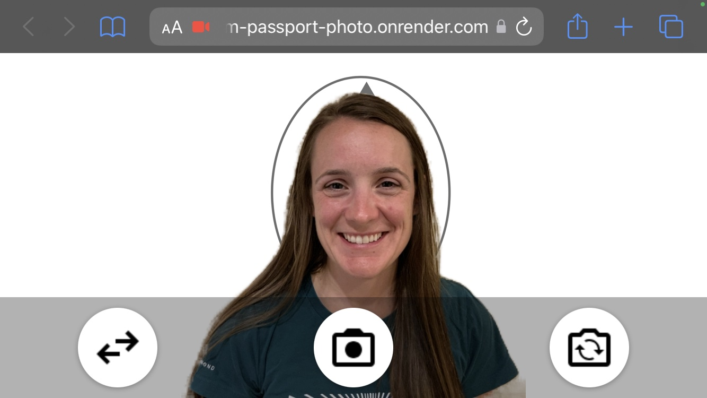

# webcam-passport-photo

Take your own passport photo in the browser. No downloads. No installs.

[Demo](https://webcam-passport-photo.onrender.com)

## How to

1. Stand next to a solid background like a wall
2. Place laptop or hold phone at eye-level
3. Don't forget to look up at the camera
4. Photos produced are `600x600` pixels or `2x2"` printed at `300dpi`
5. Print at home or CVS, Wallgreens, RiteAid for less than `$0.50`

## Philosophy

Laws are important, but they should not burden those ruled. The Post Office passport photo service costs $15. Here is a free alternative you can use yourself. Fork as you like.

## Resources 

- [Dept of State - Photo Composition Template](https://travel.state.gov/content/travel/en/us-visas/visa-information-resources/photos/photo-composition-template.html)
- [MediaPipe Selfie Segmentation](https://google.github.io/mediapipe/solutions/selfie_segmentation.html)